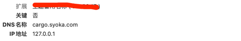

# 证书生成

## JKS (Java Key store)

```text
 -certreq            生成证书请求
 -changealias        更改条目的别名
 -delete             删除条目
 -exportcert         导出证书
 -genkeypair         生成密钥对
 -genseckey          生成密钥
 -gencert            根据证书请求生成证书
 -importcert         导入证书或证书链
 -importpass         导入口令
 -importkeystore     从其他密钥库导入一个或所有条目
 -keypasswd          更改条目的密钥口令
 -list               列出密钥库中的条目
 -printcert          打印证书内容
 -printcertreq       打印证书请求的内容
 -printcrl           打印 CRL 文件的内容
 -storepasswd        更改密钥库的存储口令
```

### 1.生成服务端密钥对

```shell
keytool -genkeypair -alias cargo -keyalg RSA -dname "CN=cargo.syoka.com,OU=network center,O=syoka,L=Shanghai,S=cargo,C=CN" -ext SAN=dns:cargo.syoka.com,ip:127.0.0.1 -keypass syoka123 -storetype PKCS12 -keystore ${PATH}cargo.jks -storepass syoka123
```

**${PATH}** 请替换为自己机器上的指定地址.比如在我电脑上是/Users/syoka/work/jks/

#### 1.1 查看JKS内部东西

```text
macbook-pro:jks syoka$ keytool -list -keystore cargo.jks
别名: cargo
创建日期: 2021-6-18
条目类型: PrivateKeyEntry
证书链长度: 1
证书[1]:
-----BEGIN CERTIFICATE-----
...............
-----END CERTIFICATE-----
输入密钥库口令:
密钥库类型: PKCS12
密钥库提供方: SUN

您的密钥库包含 1 个条目

cargo, 2021-6-18, PrivateKeyEntry
```

内部含有私钥Entry

### 2.导出服务端证书

```shell
keytool -export -alias cargo -keystore ${PATH}cargo.jks -file ${PATH}cargo.cer -storepass syoka123
```

### 3.将证书安装到主机上(双击)

#### 3.1安装后查看证书信息（系统已信任此证书）

签发者(issuer)和使用者主体(subject)一致，这是一个自签的根证书CA

- 证书基本信息
  
- 证书扩展字段(一般多域名扩展用)
  

到此JKS证书签发完成！

# 双向认证证书导入

### 1.服务端itinerary也按照之前cargo的步骤，也生成对应的jks和cer

```properties
keytool -genkeypair -alias itinerary -keyalg RSA -dname "CN=itinerary.syoka.com,OU=network center,O=syoka,L=Shanghai,S=itinerary,C=CN" -ext SAN=dns:itinerary.syoka.com,ip:127.0.0.1 -keypass syoka123 -storetype PKCS12 -keystore ${PATH}itinerary.jks -storepass syoka123
```

```properties
keytool -export -alias itinerary -keystore ${PATH}itinerary.jks -file ${PATH}itinerary.cer -storepass syoka123
```

### 2.在将cargo的cer证书导入到服务端itinerary的jks证书管理中

这样在itinerary的keystore管理中信任cargo.cer

```shell
keytool -import -keystore ${PATH}/itinerary.jks -alias cargo -file ${PATH}/cargo.cer -storepass syoka123
```

### 3.查看服务端jks

#### 服务端证书导出

## OPENSSL
