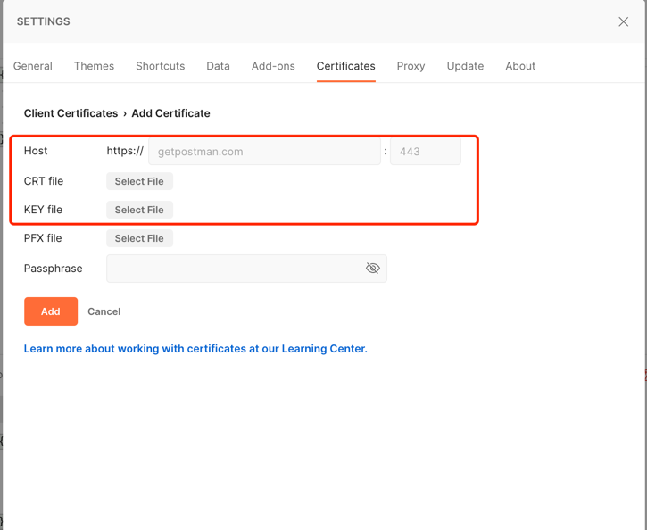

# SSL 尝试

[](https://www.apache.org/licenses/LICENSE-2.0.html)

-------

本文基于Java Springboot 项目完成一个基础的ssl通信demo

<sub>基于容器tomcat</sub>

- https单向认证（cargo作为服务器）
- https双向认证（cargo作为客户端，itinerary作为服务器）

# Quick Started

## 单向认证调试（Cargo）

### 配置相关

- application.properties

```properties
server.port=9002 #https端口
server.ssl.enabled=true
server.ssl.key-store=classpath:cargo.jks
server.ssl.key-store-password=syoka123
server.ssl.key-store-type=JKS
server.ssl.key-alias=cargo
```

密钥管理机制，JKS生成命令[参考文档](http://CERT.md)

### 调测

#### 浏览器调测

1. 访问https://localhost:9002/heartbeat


说明Chrome从证书链上不认可当前自签证书。输入`thisisunsafe`来屏蔽这个，或者换个浏览器比如safari。

## 双向认证调试（Cargo，Itinerary）

双向认证即为服务器也需要认证客户端身份，可参考文档CERT.md中关于双向认证的测试

#### POSTMAN调测



从jks中导出p12

```properties
keytool -importkeystore -srckeystore cargo.jks -srcstoretype JKS -deststoretype PKCS12 -destkeystore cargo.p12
```

导出.pem证书 .pem编码的秘钥

```properties
openssl pkcs12 -in cargo.p12 -nodes -out cargo.pem
```

从cargo.pem中取出cert和privatekey,用两个文件保存，比如cert.key，pri.key。 分别对应postman中的crt和key。

## FAQ

### 请求GET以外的接口，响应一直返回405 Method Not Allow

原因来自于Tomcat的Connector配置代码中，追加了如下代码，导致所有http请求被重新跳转到https上，跳转时的请求类型为GET.

```properties
  connector.setRedirectPort(9002);
```

### 如何取出pem中的pri和crt

最简单的是使用vim打开pem文件，拷贝---begin---,----end----之间的内容到一个新的文件中。

```properties
  connector.setRedirectPort(9002);
```

## Contributing

please contact me.

- kevinto@foxmail.com
- syoka9471@gmail.com
